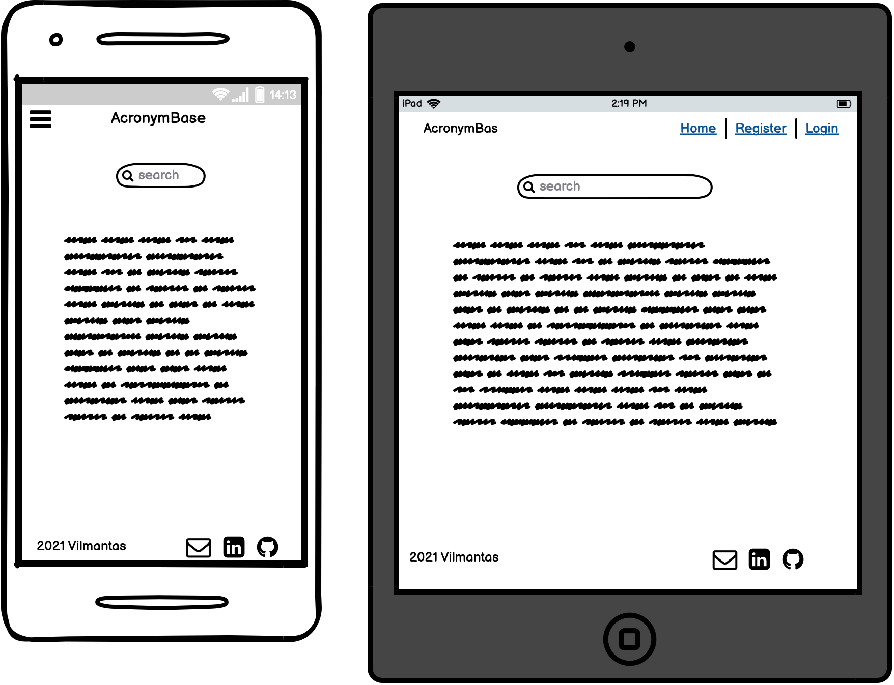
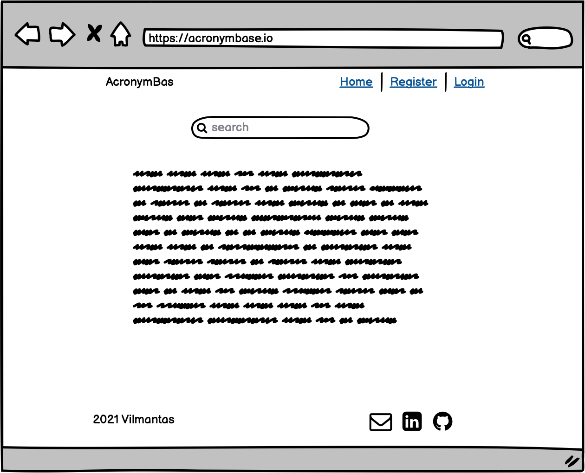
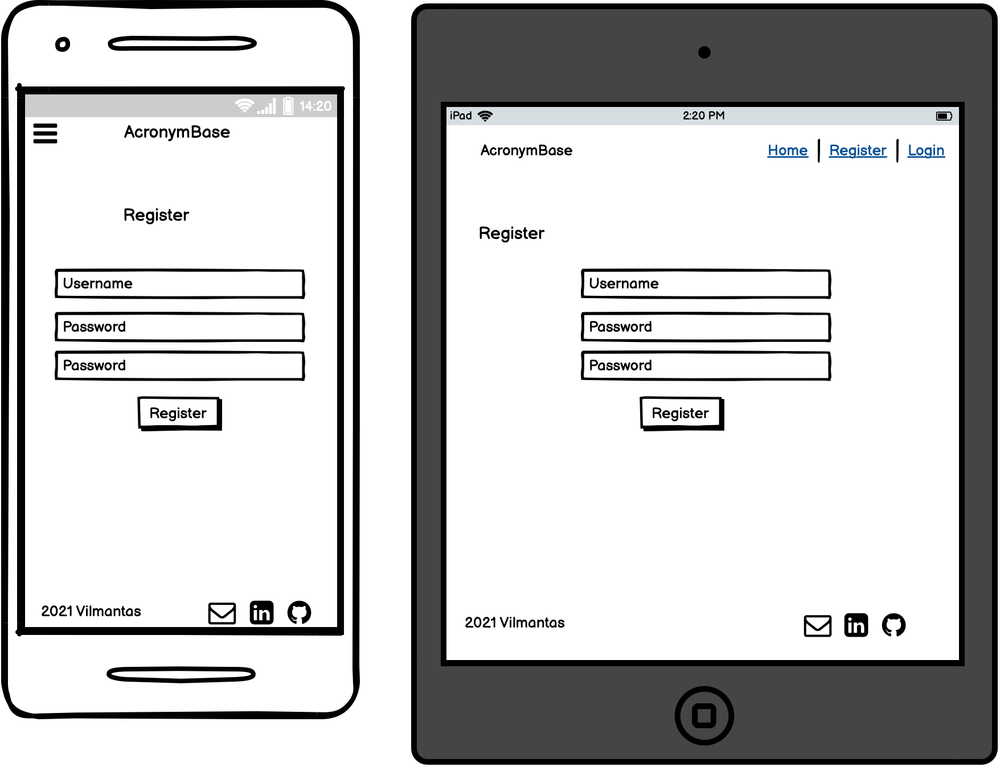
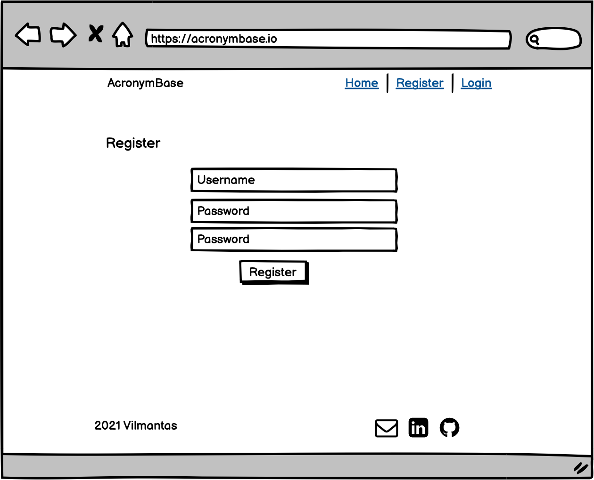
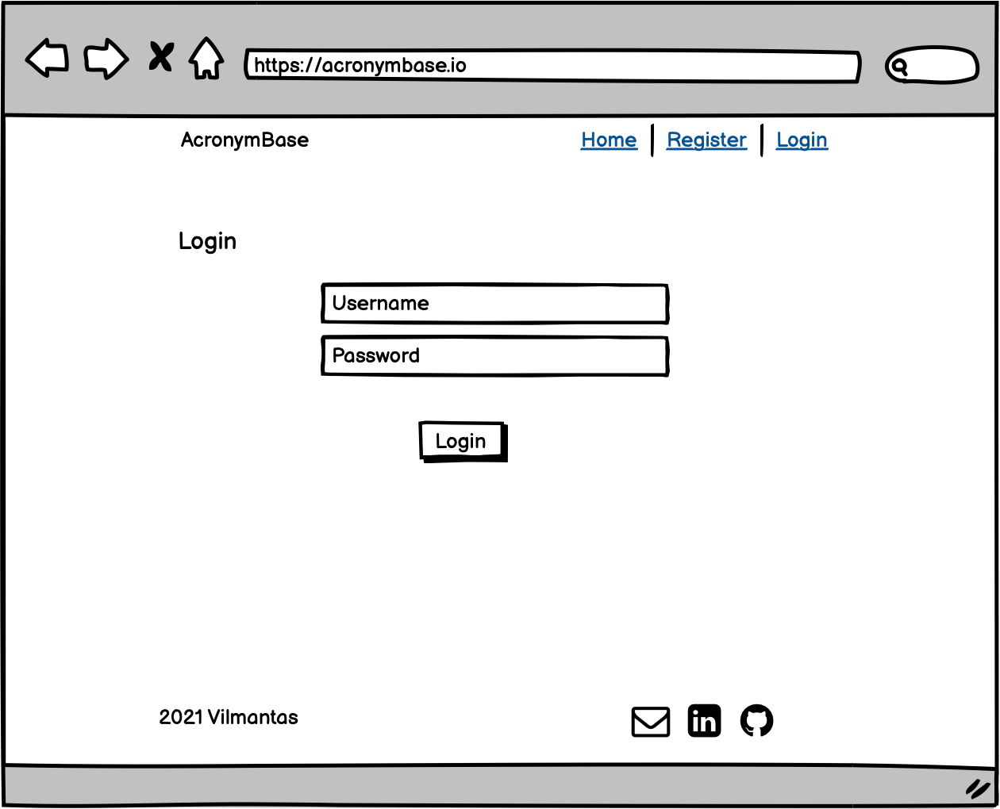
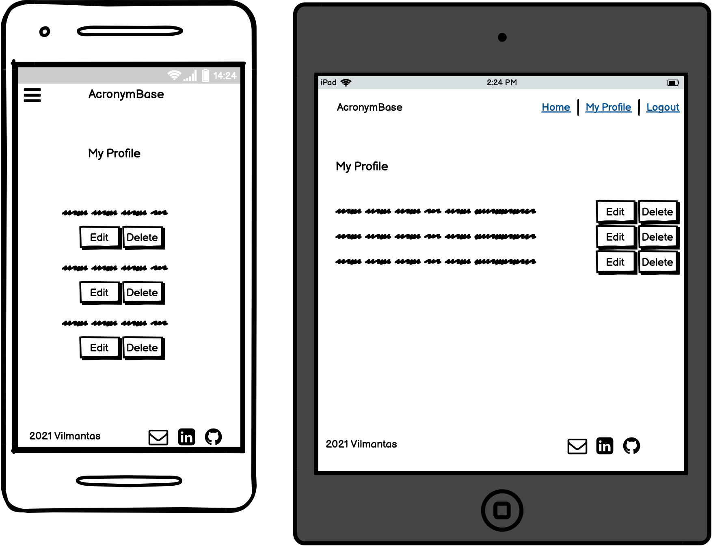
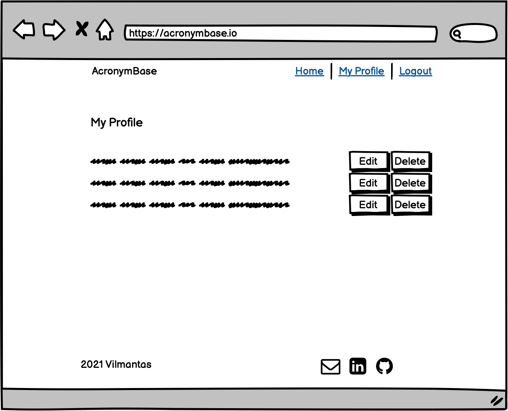
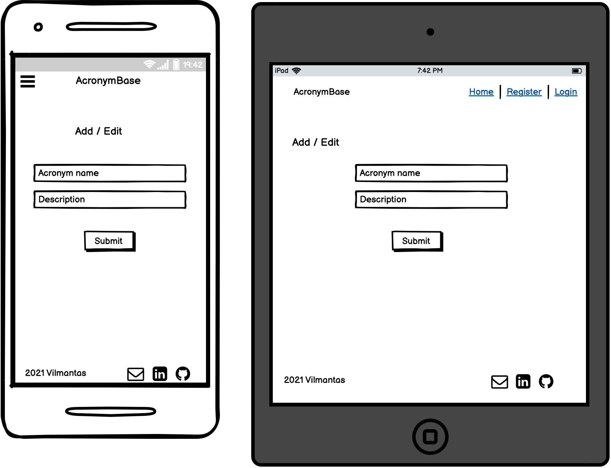
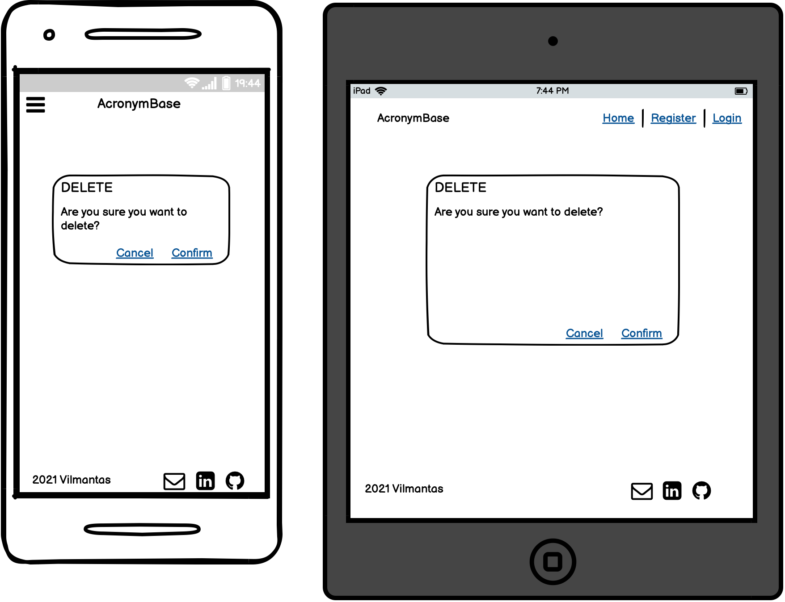
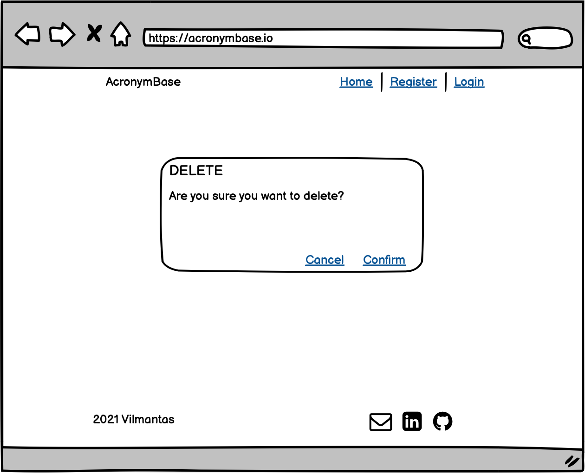

# Vilmantas Zaleckas
## Code Institute Second Milestone Project 
## **Acronym Base** - acronym database

Acronym database designed to store and search for social media acronyms.

## Index

- [Strategy](#strategy)
- [Scope](#scope)
- [User Stories](#user-stories)
- [Structure](#structure)
  - [Mobile](#mobile)
  - [Tablet](#tablet)
  - [Desktop](#desktop)
  - [Database](#database-structure)
- [Features](#features)
- [Design](#design)
- [Wireframes](#wireframes)
- [Technologies Used](#technologies-used)
- [Deployment](#deployment)
- [Credits](#credits)
- [Testing](#testing)

## Strategy

* The website with a collection of internet acronyms.
* Social media is full of acronyms and this website is made for the user to be able to look up the meanings of acronyms.
* It has search functionality and add, update and remove functionality for registered users.
* The website has user login and register features.

## Scope

The website enabling the user to quickly search the acronyms and their meanings. 
The website will have additional functionality for registered users to add new acronyms and update them as well as delete.
Page structure:
1. NavBar across all the pages with logo and links to the homepage, register or login. Registered and logged in users will have additional buttons to view their profile and log out.
2. The main page will have a search function with results being displayed below.
3. Add an acronym button available on the main page and profile page.
4. Register page will have a form for user creation: username and password fields.
5. Login page will have a form for username and password input.
6. Profile page will have a list of data entries for registered users and buttons for editing, adding or removing entries.
7. Footer across all the pages with the developer name and links for GitHub, LinkedIn websites and email.

## User Stories

* First Time Visitor:

  * As a user I would like to have a quick way to find meanings for social media acronyms.
  * As a user I would like to register on the website and have my profile.
  * As a curious user I would like to find out more about the developer or contact developer.
  * As a user I would like to add a missing acronym.
  
* Returning Visitor:
  
  * As a returning user I would like to be able to register or login into my profile.
  * As a returning user, I would like to add a new acronym to the database.
  * As a returning user I would like to update or delete my entries.
  * As a user I would like to log out of the session.
  * As a returning user I would like to contact the developer with comments, ideas or compliments.

## Structure

* Simple interface, with the main feature of quick acronym lookup.

### Mobile

* Base page structure across all pages:
  * NavBar with Logo and "hamburger" drop-down menu for links to register/log in. Additional links for registered or logged in users- Profile page and a "Logout" button.
  * Footer with developers name and GitHub, LinkedIn and Email links. 
* Home Page -  Search bar with search results displayed below.
* My Profile page - acronym entries I have created, edit/update my acronyms button, delete acronyms button.

### Tablet

* Base page structure across all pages:
  * NavBar with Logo and links to register/log in. Additional links for registered or logged in users- Profile page and a "Logout" button.
  * Footer with developers name and GitHub, LinkedIn and Email links. 
* Home Page -  Search bar and search results displayed below.
* My Profile page - acronym entries I have created, edit/update my acronyms button, delete acronyms button.

### Desktop

* Base page structure across all pages:
  * NavBar with Logo and links to register/log in. Additional links for registered or logged in users- Profile page and a "Logout" button.
  * Footer with developers name and GitHub, LinkedIn and Email links. 
* Home Page -  Search bar and search results displayed below.
* My Profile page - acronym entries I have created, edit/update my acronyms button, delete acronyms button.

### Database Structure
---

| **Acronyms Collection** | **Data Type** |
|:---:|:---|
| `_id` | *ObjectId* |
| `acronym_name` | *String* |
| `meaning` | *String* |
| `entered_by` | *String* |

---

| **Users Collection** | **Data Type** |
|:---:|:---|
| `_id` | *ObjectId* |
| `username` | *String* |
| `password` | *String* |

---

## Features

### Implemented

Website is created with functionality in mind for looking up acronyms and their meanings. 
It has a simple interface, to get the "job done" without any additional distractions or unnecessary pictures, as the site has to have a feel of dictionary pages.

* The NavBar will consist of "Logo" and navigation links. "Logo" will be located on the left side of the screen and links on the right. Mobile view will shift Logo to the centre and will have a "hamburger" drop-down menu on the right.

* Footer will have the developer name and links for Github, LinkedIn and Mail.

* Home page will consist of the search bar and search results below. No additional distractions, as the users main visit purpose is to find acronym meanings, it has to be simple and quick for getting the results. On the Home page Navbar will have links for Home, Register and Login. The Mobile version will hide these options in the "Hamburger" menu. Small "+" button for adding acronyms to the database in case the user cannot find one and would like to contribute.

* Register page will have input fields for username creation and password as well as re-enter password field. "Register" button to submit the registration form, "Cancel" button to cancel the registration.
Register page Navbar will have links for Home, Register and Login. The Mobile version will hide these options in the "Hamburger" menu. Small link for "Login" in case the user has registered already.

* Login page will have a field for entering a username, password and "Login" button, as well as the "Cancel" button. Navbar will have links for Home, Register and Login. The Mobile version will hide these options in the "Hamburger" menu.

* My profile page will list acronym entries the user has created with options to edit or delete these entries. Navbar will have links for Home, My Profile and Logout. The Mobile version will hide these options in the "Hamburger" menu.

* Add Acronym page will have a form with an acronym name field and meaning field, buttons to "Submit" and "Cancel".

* Confirm delete page will display a message to confirm, that the user wants to delete the acronym, there will be buttons to "Confirm" or "Cancel".

* Update Acronym page will have a form with prefilled Acronym Name and Meaning Fields, which he can then edit and update. Buttons to "Submit" and "Cancel".

### Enchansments For Fututre

* Have categories section to have acronyms from different areas of life.
* Have "Like" acronyms functionality.
* Email functionality for sending users their registration confirmation, login resets or updates on their acronym posts.

## Design

Page design across all the pages will consist of a black and white theme with some grey fields to stand out in the white background. The idea is to have a similar look to the physical dictionary page.
The logo will be basic and clear- "AcronymBase", highlighting it with typewriter fonts. All text and buttons will be plain and simple. 

* Logo - "AcronymBase" will have stronger look comparing to other fonts used on the page, it will have a typewriter-style font to express the idea that the page is all about text and is designed to have a similar feel to a physical dictionary page. Light grey background with black text fonts.

* Footer will have the same look as Navbar, will be grey background and black text, simple text with year and developers name on the left side and icons for Github, LinkedIn and Email on the right side.

* Search Bar will be basic and will draw users attention by being placed in the upper centre of the main page, just below the NavBar. Will have search glass icon and reset search entry button on the side.

* Search results will be shown in cards format with acronym names, their meanings and contributors username.

* Registration page - will have a simple form for username and two fields for password and password confirmation. Header "Register" at the top left of the page for letting the user know that they are on the registration page.
All is centred on the page. With a submit button below. 

* Login page will look similar to the registration page, with header "Login" and username, password input boxes. Button confirming login bellow.

* My profile page will have all current user entries displayed in rows with edit and delete buttons on the right side. Edit and delete buttons below each entry. "Admin" functionality will display all acronyms entered by different users, it will also display usernames.

* Colours - website will mainly consist of white background and black text, with light grey colours for Navbar, footer, acronym cards and forms to log in, register, add or edit acronym. Delete and cancel buttons will have a light red colour to attract users attention, but not overwhelm the overall light feel of the site. Submit, register and login buttons will have a light green colour. Flash messages shown at the top of the page to communicate with the user and their interactions will have a slightly more solid Teal colour to catch users attention and inform him if there was a mistake with an entry or entry was successful. Colours used:
  * White for background.
  * Black for text.
  * Gray #f5f5f5 for Navbar and Footer, slightly darken than cards grey to match the rest of the page but also to highlight the top and bottom areas of the page.
  * Gray #fafafa for the cards and forms the content background, to have a mild contrast with white background.
  * Light red #ef5350 to gently draw users attention for important actions like cancel, reload or delete, without overwhelming the light view of the page and content.
  * Light green #66bb6a for the submit, register, login and add acronym buttons. Matching overall light colour pallet.
  * Light Teal #26a69a colour, the strongest colour of all to catch users attention for important flash messages. 

  ### Typography

  Only two types of Google fonts have been used:
    * Special Elite - used only for logo, to add a special, stronger typewriter feel. It is easy to read, also suits perfectly the idea of typewriter logo font.
    * Public Sans - font used for the rest of body and across all elements of the website. It has a very conventional look, easy to read, but also has a hint of a unique feel.

## Wireframes

  ### Home Page

  

  
  
  ---

  ### Register Page

  

  
  
  ---

  ### Login Page

  

  
  
  ---

  ### My Profile Page

  

  
  
  ---

  ### Add / Edit Acronym

  

  
  
  ---

  ### Confirm Delete Page

  

  
  
  ---

## Technologies Used

- [HTML5](https://en.wikipedia.org/wiki/HTML5)
- [CSS3](https://en.wikipedia.org/wiki/CSS) 
- [Python](https://www.python.org/)
- [Flask](https://flask.palletsprojects.com/)
- [MongoDB](https://www.mongodb.com/) 
- [PyMongo](https://pymongo.readthedocs.io/en/stable/)
- [jQuery](http://code.jquery.com/)
- [Materialize](https://materializecss.com/)
- [Heroku](https://www.heroku.com/)
- [GitHub](https://github.com) 
- [GitPod](https://www.gitpod.io)
- [Balsamiq](https://balsamiq.com/) - for wireframes creation.
- [Google Fonts](https://fonts.google.com)
- [favicon.io](https://favicon.io/) - Favicon generator to create favicon and make it compatible with different browsers.
- [Autoprefixer](https://autoprefixer.github.io/) - parses CSS and adds vendor prefixes to CSS rules.
- [Fontawesome](https://fontawesome.com/) - Footer Social Links Icons 

## Deployment

This project was developed with the GitPod platform, code has been pushed to GitHub, the database was linked with MongoDB and deployed to Heroku.

### GitHub

To run the project locally:

1. Go to [GitHub](https://github.com/).
2. Log in to my [account](https://github.com/niekados).
3. Find repository [CI-MS3-acronym-base](https://github.com/niekados/CI-MS3-acronym-base) and open it.
4. Click the green "Code" button for the drop-down menu to appear.
5. You can clone the repository by copying the HTTPS link to your desktop IDE.
6. Alternatively you can download the ZIP file and extract it onto your computer.

To fork the repository:

1. Go to [GitHub](https://github.com/).
2. Log in to my [account](https://github.com/niekados).
3. Find repository [CI-MS3-acronym-base](https://github.com/niekados/CI-MS3-acronym-base) and open it.
4. Locate the "fork" button in the top right corner and click it.

### MongoDB

1. Go to [MongoDB](https://www.mongodb.com/) and log in
2. Click the "Create" button
3. Select cloud provider - Amazon AWS
4. Select Region - Europe
5. Assign cluster name
6. Click "Create cluster"
7. Create Database user - Database Access under Security menu
8. Whitelist IP - Network Access under Security menu
    select Allow Access From Anywhere and supply the IP address
9. Create Database in Cluster
10. Create New Collection in Database
11. Go to your database, click the "Overview" tab and click the "Connect" Button
12. Select "Connect your application", select driver as PYTHON
13. Copy amended application code and add it to Heroku Vars and `env.py` file

### Heroku 

1. Add "requirements.txt"  by typing in GitPod terminal `pip3 freeze --local > requirements.txt`
2. Add Procfile by typing `echo web: python app.py > Procfile` in the GitPod terminal
3. Login to Heroku [Heroku](https://www.heroku.com/) App 
4. Click the "New" button and from the drop-down menu select "Create new app"
5. Add app name, select region and create the app.
6. In the app go to "Deploy" 
7. Choose GitHub as Deployment Method
8. Search for your GitHub repository and click connect
9. Select the "Settings" tab
10. In the Config Vars section press "Reveal Config Vars"
11. Add your Configuration variables from your `env.py` file:
    * IP
    * PORT
    * SECRET_KEY
    * MONGODB_NAME
    * MONGO_URI
12. Go to the "Deploy" tab, in the "Manual Deploy" section click the "Deploy Branch" button. 
13. In the "Automatic Deploys" section click the "Enable Automatic Deploys" button
14. Your app has been deployed!

## Credits

I want to express my gratitude to:
* Code Institute for providing studying materials and detailed walkthrough project lessons.
* My work colleagues for support and understanding for taking time off work to complete this project.
* "Student Care" team for friendliness and support, especially Neil and Aoife, they really brought my spirit up!   

### Testing

Full testing available in the seperate file, please follow [this link](static/testing/TESTING.md) for [TESTING.md](static/testing/TESTING.md) file.