## Testing
### Acronym Base

* [Live website](https://acronym-base-ms3.herokuapp.com/)
* [GitHub Repository](https://github.com/niekados/CI-MS3-acronym-base)

 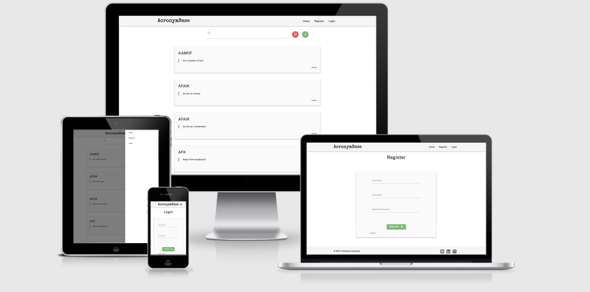

## Index

- [CSS Validation](#css-validation)
- [HTML Validation](#html-validation)
- [Lighthouse Validation](#lighthouse-validation)
- [User Stories](#user-stories)
- [Manual Testing](#manual-testing)

## CSS Validation

* Used W3C CSS Validation Service, no problems found.

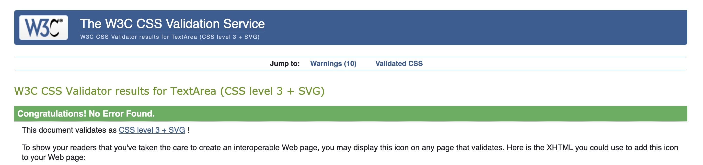

## HTML Validation

* Used W3C Markup Validation Service.
* Due to Jinja templates original HTML code from the GitHub repository was failing.
* I used deployed websites source code to validate HTML, by right-clicking on the deployed website in the web browser and choosing the "View Page Source" option.
    * There was one error coming up in the validator for `<Section>` tag where flash messages should be displayed. As there were no messages displayed, it was giving an error.
        * To override this error, I temporarily commented out the `<Section>` tag in base.html.

### Home Page

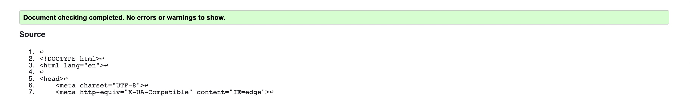

### My Profile Page

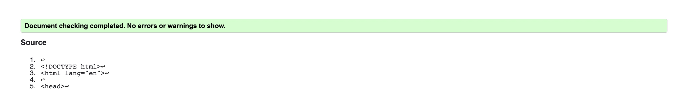

### Register Page

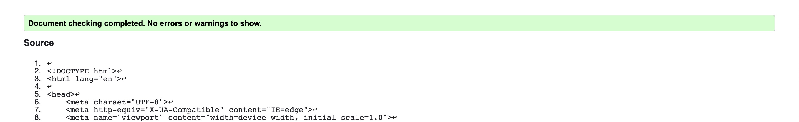

### Login Page

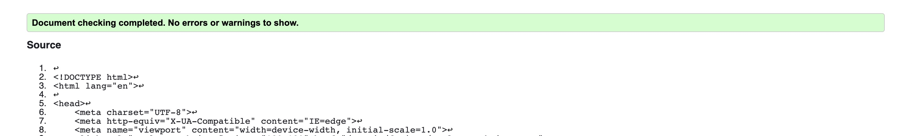

### Add Acronym Page

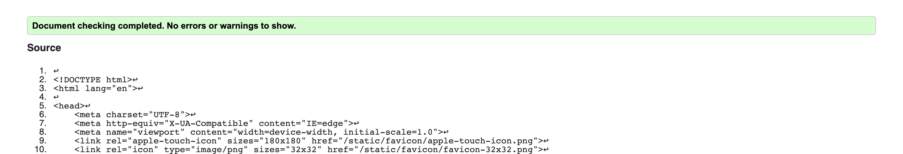

### Edit Acronym Page

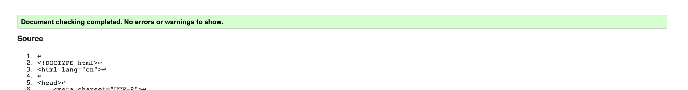

### Confirm Delete Page

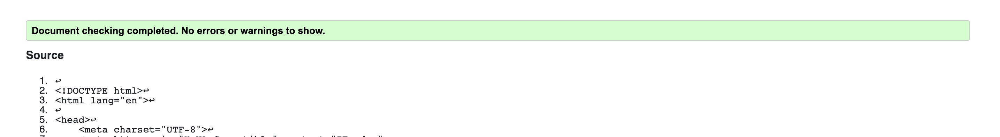

## Lighthouse Validation

* Lighthouse Validation using developer tools in Chrome browser.
    * There were some issues, mainly connected to Materialize framework used in the project and deployment through Heroku.
        * These issues were not reflecting on the purpose and objectives of the Data-Centric project.

### Home Page

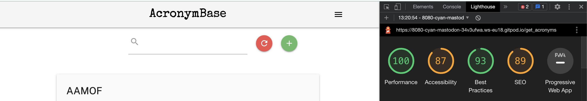

### My Profile Page

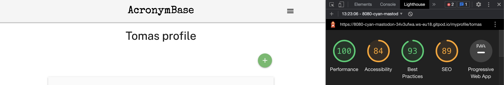

### Register Page

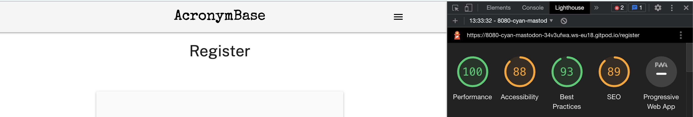

### Login Page

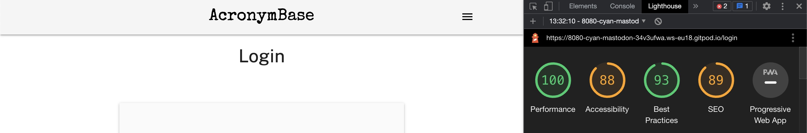

### Add Acronym 

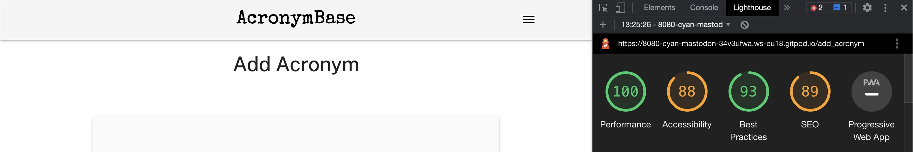

### Edit Acronym

### Confirm Delete Page

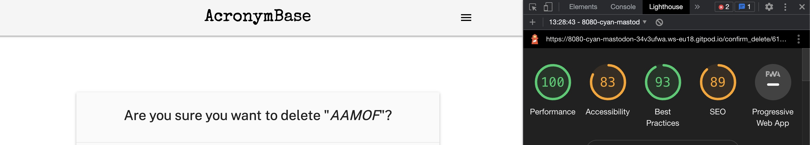

## User Stories

* First Time Visitor:
  * As a user I would like to have a quick way to find meanings for social media acronyms.
  * `Search bar available on the main page`

    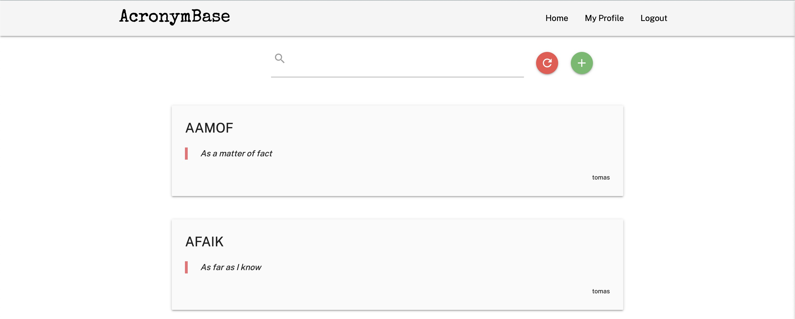

  * As a user I would like to register on the website and have my profile.
  * `Registration link available`

    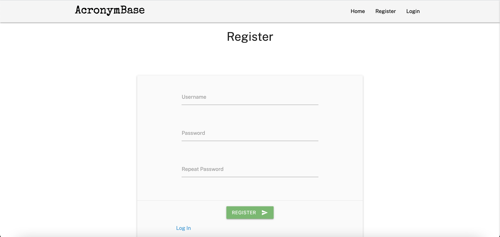

  * As a curious user I would like to find out more about the developer or contact developer.
  * `Social links located at the footer`

    

  * As a user I would like to add a missing acronym.
  * `Add "+" buttons are located on the Main page and Profile page`

    * Main Page
    
    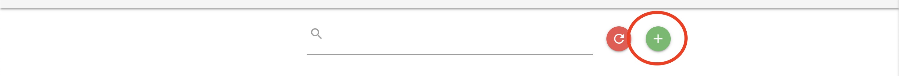

    * Profile Page

    
  
* Returning Visitor:
  
  * As a returning user I would like to be able to register or login into my profile.
  * `Register and Login links are located in the Navbar`

    * Register

    

    * Login

    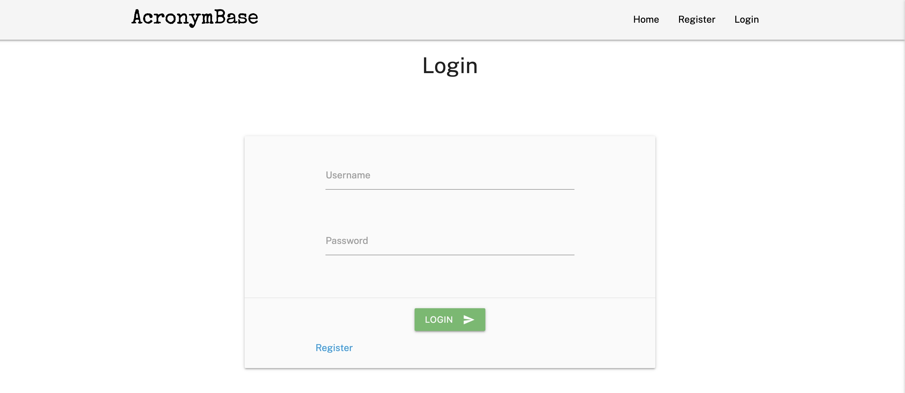

  * As a returning user, I would like to add a new acronym to the database.
  * `Add "+" buttons are located on the Main page and Profile page`

    * Main Page
    
    

    * Profile Page

    

  * As a returning user I would like to update or delete my entries.
  * `Edit and Delete buttons located in My Profile Page for the logged-in users` 

    * Update and delete

    

    * Confirm Delete

    

  * As a user I would like to log out of the session.
  * `Logout button located in the Navbar`

    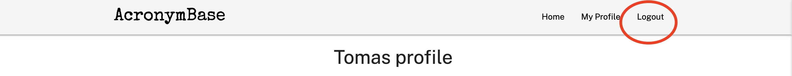

  * As a returning user I would like to contact the developer with comments, ideas or compliments.
  * `Social links located at the footer`

    

## Manual Testing

* Desktop testing was done on Chrome, Firefox and Safari
* Mobile testing was done on the iPhone Chrome and Safari

### Navbar Links

* All Links are working and redirecting to correct pages. `PASS`
* Logo redirects to home page. `PASS`
* Mobile "hamburger" side nav links are working and redirecting to correct pages. `PASS`

### Footer Social Links

* All links open in a new tab and directs to correct links. `PASS`

### Main page

* On loading the page generates acronym cards. `PASS`
* Search bar finds search entries and displays "No results found" if search entry doesn't exist. `PASS`
* Reset search entry resets the page and reloads the main page with all acronym cards. `PASS`
* Add Acronym "+" button redirects to Add Acronym page or to Login page if the user is not logged in. `PASS`

### My Profile Page

* User acronyms are filtered to display only their entries. `PASS`
* Admin user has all acronyms shown with contributors usernames. `PASS`
* Add Acronym "+" button redirects to Add Acronym page. `PASS`
* Edit Acronym button redirects to Edit Acronym page with the acronym form prefilled. `PASS`
* Delete Acronym button redirects the user to the Delete Confirmation page. `PASS`

### Register Page

* Entering username in use displays a flash message that username already exists. `PASS`
* If re-enter password doesn't match with the password, the flash message is displayed with the message that passwords do not match. `PASS`
* Registration is confirmed with the flash message that the user is registered and redirects to the My Profile page. `PASS`
* Login link redirects to the Login page. `PASS`

### Login

* Entering incorrect username or/and password generates a message that login details do not match. `PASS`
* Register link redirects the user to the Registration Page. `PASS`

### Add Acronym

* Displays form with Acronym and Definition fields. `PASS`
* If entered Acronym already exists in database flash message being displayed that acronym already exist and reloads Add Acronym Page. `PASS`
* Cancel button doesn't post form entries and redirects user to My Profile Page. `PASS`
* Submit button inserts entries into the database. `PASS`

### Edit Acronym

* Displays form with correct Acronym and Definition fields pre-filled. `PASS`
* Cancel button doesn't post form entries and redirects user to My Profile Page.`PASS`
* Submit button inserts entries into the database. `PASS`

### Confirm Delete

* Displays the user the message if they want to delete the acronym and inserts the correct acronym name. `PASS`
* Delete button removes the correct entry from the database and redirects user to My Profile page. `PASS`
* Cancel button reverts delete action and redirects user to My Profile page. `PASS`
